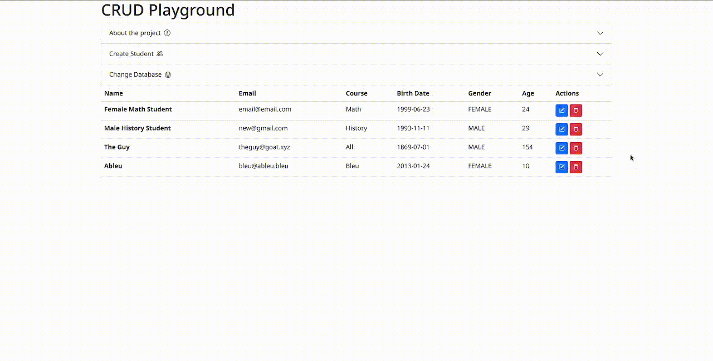

# Frontend

The front-end is a Angular application that runs on the port 4200.

## How to Run?

You'll need the following installed in your machine:

* npm (or similar package manager, like yarn)

after installing a JS package manager, run `npm install` to install the dependencies, and then `npm start` to start the web-server, or, if you have *angular-cli*, use `ng serve` to start the application.

The front-end expects the back-end will be hearing for requests at **localhost:8080** and that is defined in the `crudplayground/src/app/services/api.service.ts` file.

# Back-end

The backend is a default Springboot application that runs on the port 8080.

## How to Run?

You'll need the following installed in your machine:

* Maven
* MongoDB
* PostgreSQL

after installing, you'll need to change the configuration files to connect to the databases on `application.properties` at `/crudplayground/src/main/resources/application.properties` for production and at `/crudplayground/src/test/resources/application.properties` to run the unit tests. Just change the `spring.data.mongodb` and `spring.datasource` configurations with your database's settings then compile and run the project.
